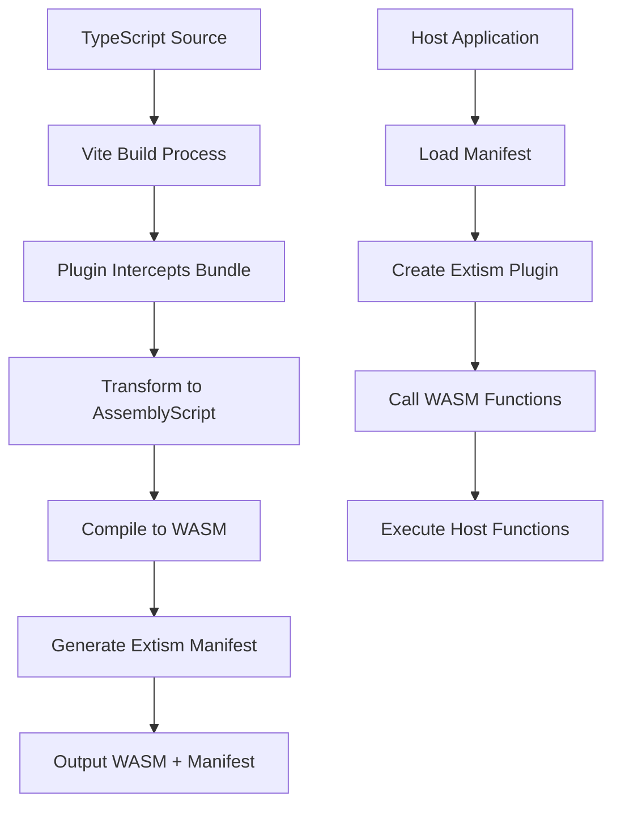

# Vite Plugin Extism - Complete Example

This directory contains a complete working example of the Vite Plugin Extism that converts your TypeScript/JavaScript source files into an Extism WebAssembly plugin.

## What You've Created

### 🔧 **Plugin Implementation** (`vite-plugin-extism.ts`)
A comprehensive Vite plugin that:
- Hooks into Vite's build process
- Compiles TypeScript/JavaScript to WASM using AssemblyScript
- Generates Extism-compatible manifests
- Supports host function definitions
- Provides extensive configuration options

### ⚙️ **Configuration Example** (`vite.config.extism.ts`)
Shows how to configure the plugin with:
- Custom entry points
- Host function definitions
- Manifest configuration
- AssemblyScript compiler options
- Code transformation hooks

### 🎮 **WASM Entry Point** (`src/main-wasm.ts`)
Example game logic written for WASM compilation:
- Beat detection algorithms
- Score management
- Input handling
- Host function usage

### 🖥️ **Host Application** (`host-demo.js`)
Demonstrates how to:
- Load the generated WASM plugin
- Implement host functions
- Call WASM functions from JavaScript
- Handle plugin communication

## Quick Start

1. **Build the WASM plugin**:
```bash
npm run build:wasm
```

2. **Run the host application demo**:
```bash
npm run demo:host
```

## Generated Output

The plugin creates:
- `dist-extism/rhylok-game.wasm` - Compiled WebAssembly module
- `dist-extism/manifest.json` - Extism plugin manifest

## How It Works



## Key Features Demonstrated

### 🎯 **Host Functions**
- `log()` - Console output from WASM
- `playSound()` - Audio playback
- `getTime()` - Timestamp access
- `httpRequest()` - Network requests

### 🧮 **WASM Exports**
- `initGame()` - Initialize game state
- `processAudio()` - Beat detection
- `handleInput()` - User input processing
- `getGameState()` - State serialization

### 📦 **Build Pipeline**
- Vite bundling and dependency resolution
- TypeScript to AssemblyScript transformation
- WASM compilation with optimization
- Extism manifest generation

## Real-World Usage

This plugin enables you to:

1. **Game Engines**: Compile game logic to WASM for performance
2. **Audio Processing**: Real-time audio analysis in WASM
3. **Data Processing**: CPU-intensive algorithms in WASM
4. **Plugin Systems**: Create extensible applications with WASM plugins
5. **Cross-Platform**: Run same logic across web, server, and mobile

## Next Steps

1. **Install Extism**: `npm install @extism/extism`
2. **Customize**: Modify `vite-plugin-extism.ts` for your needs
3. **Extend**: Add more host functions for your use case
4. **Deploy**: Use generated WASM in production applications

## Architecture Benefits

- ⚡ **Performance**: WASM execution speed
- 🔒 **Security**: Sandboxed execution environment
- 🔌 **Modularity**: Plugin-based architecture
- 📦 **Portability**: Run anywhere Extism is supported
- 🛠️ **Developer Experience**: Use familiar TypeScript/JavaScript

This plugin bridges the gap between modern web development tooling (Vite) and WebAssembly plugin systems (Extism), providing a seamless developer experience for creating high-performance, portable code.
